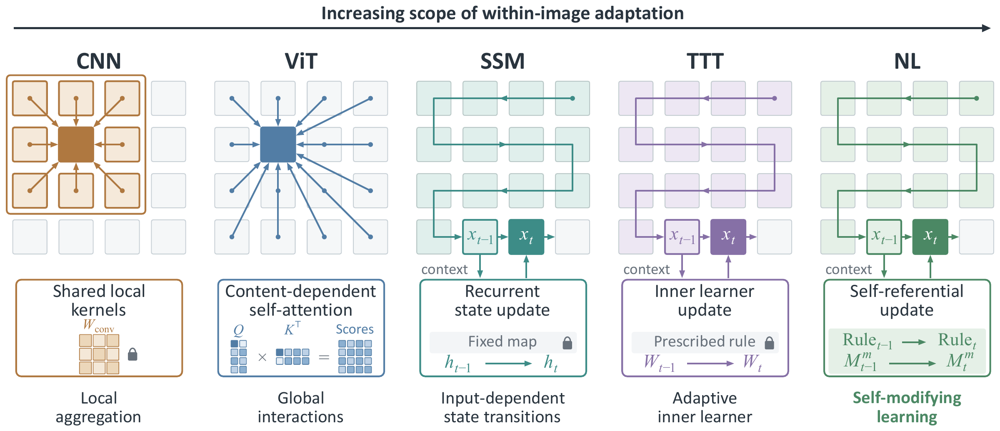

<div align="center">

<h1>VisionHOPE</h1>

<p><strong>Visual Backbones as Self-Modifying Learning Systems</strong></p>

<p>
  Siran Peng<sup>*</sup> · Tianshuo Zhang<sup>*</sup> · Tianyu Fu · Weisong Zhao · Haoyuan Zhang<br>
  Jiankuo Zhao · Minghui Wu · Ping Jiang · Xiangyu Zhu · Chenxu Zhao<sup>†</sup> · Zhen Lei<sup>†</sup>
</p>
<p><sup>*</sup> Equal contribution. &nbsp; <sup>†</sup>Corresponding authors.</p>

<p>
  <a href="https://arxiv.org/abs/2609.33325"></a>
  <a href="#installation"></a>
  <a href="https://huggingface.co/PSRben/VisionHOPE"></a>
  <a href="LICENSE"></a>
</p>

<p>
  <a href="https://arxiv.org/abs/2609.33325">📄 Paper</a> ·
  <a href="https://huggingface.co/papers/2609.33325">🤗 Hugging Face Paper</a> ·
  <a href="#updates">Updates</a> ·
  <a href="#overview">Overview</a> ·
  <a href="#main-results">Results &amp; checkpoints</a> ·
  <a href="#citation">Citation</a>
</p>

<p>
  <a href="#installation">Installation</a> ·
  <a href="#models">Models</a> ·
  <a href="#srnl-and-visionhope-operator">SRNL &amp; operator</a> ·
  <a href="#fast-inference">Fast inference</a> ·
  <a href="#datasets">Datasets</a> ·
  <a href="#training">Training</a> ·
  <a href="#evaluation">Evaluation</a> ·
  <a href="#efficiency">Efficiency</a>
</p>

</div>

PyTorch implementation of **VisionHOPE**, a visual backbone based on self-referential nested learning (SRNL).
This repository provides ImageNet classification, COCO detection and instance segmentation, and ADE20K semantic segmentation, along with standalone SRNL and VisionHOPE operator modules.

**Pretrained weights:** [GitHub Releases](https://github.com/PSRben/VisionHOPE/releases/tag/weights-v1) · [Hugging Face](https://huggingface.co/PSRben/VisionHOPE) · [Baidu Netdisk](https://pan.baidu.com/s/1RxQD6Ft11aSlPHHJt0mg9w) (`visionhope_weights`, access code: `8866`).

<p align="center">
  <a href="assets/visionhope-concept.png"></a>
</p>
<p align="center"><sub>From static local aggregation to self-modifying learning within an image.</sub></p>

## Updates

- **2026-09-29** · Pretrained checkpoints for ImageNet-1K, COCO, and ADE20K are available from [GitHub Releases](https://github.com/PSRben/VisionHOPE/releases/tag/weights-v1), [Hugging Face](https://huggingface.co/PSRben/VisionHOPE), and [Baidu Netdisk](https://pan.baidu.com/s/1RxQD6Ft11aSlPHHJt0mg9w) (access code: `8866`).
- **2026-09-27** · The [VisionHOPE preprint](https://arxiv.org/abs/2609.33325) is available on arXiv.

## Overview

VisionHOPE builds on the self-referential construction in [Nested Learning: The Illusion of Deep Learning Architectures](https://arxiv.org/abs/2512.24695). It lets **what the model remembers and how it learns evolve together** while processing an image. The VisionHOPE operator combines:

1. **Coupled memories.** Five memories store content, generate key and value representations, and govern learning rate and retention. They co-evolve as visual context accumulates.
2. **Stable updates.** A soft injection cap and a spectral clamp provide non-expansion guarantees for both token-wise and chunk-wise memory recurrences.
3. **Spatially aligned scans.** Four directional scans use row- and column-aligned chunks, followed by spatial restoration and learned channel-wise fusion.

<p align="center">
  <a href="assets/visionhope-architecture.png"></a>
</p>
<p align="center"><sub>The VisionHOPE operator (left) and residual block (right). Click the figure to inspect the full resolution.</sub></p>

The hierarchical **Tiny / Small / Base** backbones support classification and dense prediction. For use in other architectures, see the standalone [SRNL, operator, and block interfaces](#srnl-and-visionhope-operator).

## Installation

Use Linux with an NVIDIA GPU and the CUDA toolkit, including `nvcc` and a C++ compiler.
Python 3.10 is recommended for all tasks; classification also supports Python 3.11.
Run the following from the repository root, with CUDA 12.1 installed:

```bash
python -m pip install torch==2.1.0 torchvision==0.16.0 \
    --index-url https://download.pytorch.org/whl/cu121
python -m pip install -r requirements/classification.txt
python -m pip install --no-deps -e .
```

CUDA extensions compile on first use. Keep model parameters in FP32 and use `torch.autocast` for mixed precision.

<details>
<summary>Additional dependencies for COCO and ADE20K</summary>

Use a separate Python 3.10 environment for each task, with the PyTorch and CUDA versions above. Install MMCV, then the task dependencies:

```bash
python -m pip install --only-binary=mmcv mmcv==2.1.0 \
    -f https://download.openmmlab.com/mmcv/dist/cu121/torch2.1/index.html
```

For COCO:

```bash
python -m pip install -r requirements/detection.txt
python -m pip install --no-deps -e .
```

For ADE20K:

```bash
python -m pip install -r requirements/segmentation.txt
python -m pip install --no-deps -e .
```

</details>

## Models

Use these model names and checkpoint filenames for ImageNet-1K classification at 224 × 224. Accuracy and complexity are listed in [Main results](#main-results).

| Model | Name | Checkpoint filename |
| :--- | :--- | :--- |
| VisionHOPE-T | `visionhope_tiny` | `visionhope_tiny.pth` |
| VisionHOPE-S | `visionhope_small` | `visionhope_small.pth` |
| VisionHOPE-B | `visionhope_base` | `visionhope_base.pth` |

The train/test scripts look for checkpoints in `weights/`; set `WEIGHTS_ROOT` to use another directory.
COCO checkpoints are named `visionhope_<size>_coco_<schedule>.pth` (e.g. `visionhope_small_coco_3x.pth`); ADE20K checkpoints are named `visionhope_<size>_ade20k.pth`.

Download a checkpoint from [Hugging Face](https://huggingface.co/PSRben/VisionHOPE) into `weights/` with the [Hugging Face CLI](https://huggingface.co/docs/huggingface_hub/guides/cli). Run these commands from the repository root:

```bash
python -m pip install --upgrade huggingface_hub
hf download PSRben/VisionHOPE visionhope_small.pth --local-dir weights
```

Replace `visionhope_small.pth` with the checkpoint filename for your model and task. To download all classification, COCO, and ADE20K checkpoints:

```bash
hf download PSRben/VisionHOPE --include "visionhope_*.pth" --local-dir weights
```

Load an ImageNet-1K checkpoint with Python:

```python
import torch
from visionhope.models import create_model

model = create_model(
    "visionhope_small", checkpoint_path="weights/visionhope_small.pth"
).cuda().eval()

with torch.inference_mode():
    logits = model(torch.randn(1, 3, 224, 224, device="cuda"))  # [1, 1000]
```

Omit `checkpoint_path` to create a model for training.

## SRNL and VisionHOPE operator

**SRNL** accepts sequences of shape `[batch, tokens, dim]` and returns the same shape:

```python
import torch
from visionhope.models import SRNL

srnl = SRNL(dim=64, head_dim=16, chunk_size=64).cuda()
x = torch.randn(2, 257, 64, device="cuda", requires_grad=True)
y = srnl(x)
y.square().mean().backward()
```

Pass `srnl(x, queries=q)` to supply queries of the same shape as `x`; otherwise, `x` is also used as the query.
Each forward call starts a new sequence. `dim` must be divisible by `head_dim`, which supports 4, 8, 16, 32, and 64.

**VisionHOPEOperator** and **VisionHOPEBlock** accept image features in `[batch, channels, height, width]` format and preserve their shape:

```python
import torch
from visionhope.models import VisionHOPEOperator, VisionHOPEBlock

x = torch.randn(2, 64, 14, 20, device="cuda")
operator = VisionHOPEOperator(dim=64, head_dim=16).cuda()
block = VisionHOPEBlock(dim=64, mixer_dim=32, head_dim=16).cuda()

y = operator(x)
z = block(x)
```

`mixer_dim` sets the block's internal width. All three components require CUDA and support training with autograd.

`chunk_size=None` uses 64-token chunks for standalone SRNL and row/column chunks for image operators and blocks. You can also specify a positive chunk length; rectangular feature maps and sequences with an incomplete final chunk are supported.

## Fast inference

For standalone SRNL and operators, set `fast_inference=True`, call `.eval()`, and disable gradients:

```python
import torch
from visionhope.models import SRNL, VisionHOPEOperator

srnl = SRNL(dim=64, fast_inference=True).cuda().eval()
operator = VisionHOPEOperator(dim=64, fast_inference=True).cuda().eval()

with torch.inference_mode():
    y = srnl(torch.randn(2, 257, 64, device="cuda"))
    z = operator(torch.randn(2, 64, 14, 20, device="cuda"))
```

The same flag can be changed after construction, for example `srnl.fast_inference = True`.
It leaves weights unchanged and does not affect training. If you supply separate SRNL queries, their dtype must match the input for fast inference.

For blocks and complete models, use `prepare_for_inference` after loading weights:

```python
import torch
from visionhope.models import create_model
from visionhope.inference.prepare import prepare_for_inference

model = create_model(
    "visionhope_small", checkpoint_path="weights/visionhope_small.pth"
).cuda().eval()
prepare_for_inference(model)

with torch.inference_mode(), torch.autocast("cuda", dtype=torch.bfloat16):
    logits = model(torch.randn(1, 3, 224, 224, device="cuda"))
```

`prepare_for_inference` fuses model parameters in place for fast inference. Keep an unprepared copy if you also need to continue training.
The test scripts below enable fast inference by default; pass `--mode ordinary` to disable it.

## Datasets

Download [ImageNet-1K (ILSVRC 2012)](https://www.image-net.org/challenges/LSVRC/2012/2012-downloads.php), [COCO 2017](https://cocodataset.org/#download), and [ADE20K](http://sceneparsing.csail.mit.edu/) from their official websites.

Arrange the datasets as follows, or point the scripts to equivalent locations with `--data-root`:

```text
data/
├── imagenet/
│   ├── train/<class_name>/*.JPEG
│   └── val/<class_name>/*.JPEG
├── coco/
│   ├── train2017/
│   ├── val2017/
│   └── annotations/instances_{train,val}2017.json
└── ade20k/
    ├── images/{training,validation}/
    └── annotations/{training,validation}/
```

You can also set `IMAGENET_ROOT`, `COCO_ROOT`, and `ADE20K_ROOT` to your dataset directories.
For ADE20K, use the extracted `ADEChallengeData2016` directory as the root.

## Training

The scripts in [scripts/train](scripts/train) contain the training recipes. Matching evaluation scripts are in [scripts/test](scripts/test).

| Task | Sizes | Script name |
| --- | --- | --- |
| ImageNet-1K | `tiny`, `small`, `base` | `visionhope_<size>.sh` |
| COCO, Mask R-CNN 1× | `tiny`, `small`, `base` | `visionhope_<size>_coco_1x.sh` |
| COCO, Mask R-CNN 3× | `tiny`, `small` | `visionhope_<size>_coco_3x.sh` |
| ADE20K, UPerNet | `tiny`, `small`, `base` | `visionhope_<size>_ade20k.sh` |

For example, to train VisionHOPE-S on eight GPUs:

```bash
# ImageNet-1K
NPROC_PER_NODE=8 bash scripts/train/visionhope_small.sh \
    --data-root data/imagenet --output outputs/visionhope_small

# COCO
NPROC_PER_NODE=8 bash scripts/train/visionhope_small_coco_1x.sh \
    --data-root data/coco --pretrained weights/visionhope_small.pth

# ADE20K
NPROC_PER_NODE=8 bash scripts/train/visionhope_small_ade20k.sh \
    --data-root data/ade20k --pretrained weights/visionhope_small.pth
```

Training defaults to eight GPUs. Set `NPROC_PER_NODE=1` for a single GPU. `--batch-size` is per GPU; the learning rate scales with the effective global batch unless `--lr` is given.
Arguments appended to a script override its defaults. COCO and ADE20K training use ImageNet-pretrained backbones.

Outputs go to `outputs/train/<script-name>/` unless `--output` is supplied.
Use `best.pth` for evaluation and `training_state.pth` to resume training:

```bash
bash scripts/train/visionhope_small.sh \
    --resume outputs/visionhope_small/training_state.pth \
    --output outputs/visionhope_small
```

For argument descriptions, defaults, and choices:

```bash
python -m visionhope.tasks.cli train classification --help
```

Replace `classification` with `detection` or `segmentation` for the other tasks.

## Evaluation

Run the matching test script with a checkpoint and dataset:

```bash
CUDA_VISIBLE_DEVICES=0 bash scripts/test/visionhope_small.sh \
    --data-root data/imagenet --checkpoint weights/visionhope_small.pth

CUDA_VISIBLE_DEVICES=0 bash scripts/test/visionhope_small_coco_1x.sh \
    --data-root data/coco --checkpoint weights/visionhope_small_coco_1x.pth

CUDA_VISIBLE_DEVICES=0 bash scripts/test/visionhope_small_ade20k.sh \
    --data-root data/ade20k --checkpoint weights/visionhope_small_ade20k.pth
```

The scripts set the evaluation precision and preprocessing for each task. ImageNet evaluation uses FP32, 224 × 224 inputs, and crop ratio 1.0.
Pass `--precision fp16` or `--precision bf16` to a test script for mixed-precision evaluation.
Classification accepts `--num-classes` to match the checkpoint's output classes and `--no-cudnn-benchmark` to disable cuDNN algorithm benchmarking.
For COCO and ADE20K, use `--test-scale W H` to change the resize scale while keeping the aspect ratio; defaults are `1333 800` and `2048 512`, respectively.
ADE20K evaluation defaults to batch size 1; larger batches require images of the same size after preprocessing.
Results are saved under `outputs/test/<script-name>/`; pass `--output` with a different directory for another evaluation of the same model.
Use `python -m visionhope.tasks.cli inference classification --help` for evaluation options; the other task names work here too.

## Main results

The tables below summarize ImageNet-1K, COCO, and ADE20K results for the **hierarchical VisionHOPE-T / S / B** models. See the [paper](https://arxiv.org/abs/2609.33325) for experimental details. Pretrained checkpoints are available from [GitHub Releases](https://github.com/PSRben/VisionHOPE/releases/tag/weights-v1), [Hugging Face](https://huggingface.co/PSRben/VisionHOPE), and [Baidu Netdisk](https://pan.baidu.com/s/1RxQD6Ft11aSlPHHJt0mg9w) (access code: `8866`).

### ImageNet-1K classification

Trained on ImageNet-1K; single-crop evaluation at **224 × 224**. FLOPs include the classification head.

| Model | Params (M) | FLOPs (G) | Top-1 (%) ↑ | Recipe | CKPT |
| :--- | ---: | ---: | ---: | :---: | :---: |
| **VisionHOPE-T** | 26.6 | 4.9 | **84.1** | [Train](scripts/train/visionhope_tiny.sh) / [Eval](scripts/test/visionhope_tiny.sh) | [GitHub](https://github.com/PSRben/VisionHOPE/releases/download/weights-v1/visionhope_tiny.pth) / [Hugging Face](https://huggingface.co/PSRben/VisionHOPE/resolve/main/visionhope_tiny.pth?download=true) |
| **VisionHOPE-S** | 52.9 | 9.8 | **85.2** | [Train](scripts/train/visionhope_small.sh) / [Eval](scripts/test/visionhope_small.sh) | [GitHub](https://github.com/PSRben/VisionHOPE/releases/download/weights-v1/visionhope_small.pth) / [Hugging Face](https://huggingface.co/PSRben/VisionHOPE/resolve/main/visionhope_small.pth?download=true) |
| **VisionHOPE-B** | 91.2 | 17.3 | **85.6** | [Train](scripts/train/visionhope_base.sh) / [Eval](scripts/test/visionhope_base.sh) | [GitHub](https://github.com/PSRben/VisionHOPE/releases/download/weights-v1/visionhope_base.pth) / [Hugging Face](https://huggingface.co/PSRben/VisionHOPE/resolve/main/visionhope_base.pth?download=true) |

### COCO detection and instance segmentation

**Mask R-CNN**, initialized with ImageNet-1K-pretrained backbones and evaluated on **val2017**. FLOPs are for the full detector at **1280 × 800**. Box AP and mask AP are reported in percent.

**1× schedule**

| Backbone | FLOPs (G) | Box AP ↑ | Mask AP ↑ | Recipe | CKPT |
| :--- | ---: | ---: | ---: | :---: | :---: |
| **VisionHOPE-T** | 266 | **47.9** | **43.1** | [Train](scripts/train/visionhope_tiny_coco_1x.sh) / [Eval](scripts/test/visionhope_tiny_coco_1x.sh) | [GitHub](https://github.com/PSRben/VisionHOPE/releases/download/weights-v1/visionhope_tiny_coco_1x.pth) / [Hugging Face](https://huggingface.co/PSRben/VisionHOPE/resolve/main/visionhope_tiny_coco_1x.pth?download=true) |
| **VisionHOPE-S** | 365 | **49.5** | **44.2** | [Train](scripts/train/visionhope_small_coco_1x.sh) / [Eval](scripts/test/visionhope_small_coco_1x.sh) | [GitHub](https://github.com/PSRben/VisionHOPE/releases/download/weights-v1/visionhope_small_coco_1x.pth) / [Hugging Face](https://huggingface.co/PSRben/VisionHOPE/resolve/main/visionhope_small_coco_1x.pth?download=true) |
| **VisionHOPE-B** | 516 | **50.5** | **45.0** | [Train](scripts/train/visionhope_base_coco_1x.sh) / [Eval](scripts/test/visionhope_base_coco_1x.sh) | [GitHub](https://github.com/PSRben/VisionHOPE/releases/download/weights-v1/visionhope_base_coco_1x.pth) / [Hugging Face](https://huggingface.co/PSRben/VisionHOPE/resolve/main/visionhope_base_coco_1x.pth?download=true) |

**3× schedule**

| Backbone | FLOPs (G) | Box AP ↑ | Mask AP ↑ | Recipe | CKPT |
| :--- | ---: | ---: | ---: | :---: | :---: |
| **VisionHOPE-T** | 266 | **49.4** | **44.1** | [Train](scripts/train/visionhope_tiny_coco_3x.sh) / [Eval](scripts/test/visionhope_tiny_coco_3x.sh) | [GitHub](https://github.com/PSRben/VisionHOPE/releases/download/weights-v1/visionhope_tiny_coco_3x.pth) / [Hugging Face](https://huggingface.co/PSRben/VisionHOPE/resolve/main/visionhope_tiny_coco_3x.pth?download=true) |
| **VisionHOPE-S** | 365 | **50.5** | **45.0** | [Train](scripts/train/visionhope_small_coco_3x.sh) / [Eval](scripts/test/visionhope_small_coco_3x.sh) | [GitHub](https://github.com/PSRben/VisionHOPE/releases/download/weights-v1/visionhope_small_coco_3x.pth) / [Hugging Face](https://huggingface.co/PSRben/VisionHOPE/resolve/main/visionhope_small_coco_3x.pth?download=true) |

### ADE20K semantic segmentation

**UPerNet**, initialized with ImageNet-1K-pretrained backbones; **single-scale** validation. Parameters are for the complete model; inference FLOPs are measured at **512 × 2048**.

| Backbone | Params (M) | FLOPs (G) | mIoU (%) ↑ | Recipe | CKPT |
| :--- | ---: | ---: | ---: | :---: | :---: |
| **VisionHOPE-T** | 55.4 | 942 | **49.4** | [Train](scripts/train/visionhope_tiny_ade20k.sh) / [Eval](scripts/test/visionhope_tiny_ade20k.sh) | [GitHub](https://github.com/PSRben/VisionHOPE/releases/download/weights-v1/visionhope_tiny_ade20k.pth) / [Hugging Face](https://huggingface.co/PSRben/VisionHOPE/resolve/main/visionhope_tiny_ade20k.pth?download=true) |
| **VisionHOPE-S** | 81.8 | 1043 | **50.3** | [Train](scripts/train/visionhope_small_ade20k.sh) / [Eval](scripts/test/visionhope_small_ade20k.sh) | [GitHub](https://github.com/PSRben/VisionHOPE/releases/download/weights-v1/visionhope_small_ade20k.pth) / [Hugging Face](https://huggingface.co/PSRben/VisionHOPE/resolve/main/visionhope_small_ade20k.pth?download=true) |
| **VisionHOPE-B** | 121.2 | 1200 | **51.8** | [Train](scripts/train/visionhope_base_ade20k.sh) / [Eval](scripts/test/visionhope_base_ade20k.sh) | [GitHub](https://github.com/PSRben/VisionHOPE/releases/download/weights-v1/visionhope_base_ade20k.pth) / [Hugging Face](https://huggingface.co/PSRben/VisionHOPE/resolve/main/visionhope_base_ade20k.pth?download=true) |

See [Evaluation](#evaluation) for precision and preprocessing, and [Efficiency](#efficiency) for FLOP-counting and timing conventions.

## Efficiency

Measure parameters, inference FLOPs, throughput, and GPU memory without a dataset:

```bash
bash run_inference.sh complexity --model visionhope_small
bash run_inference.sh efficiency --model visionhope_small

bash run_inference.sh complexity --task detection --model visionhope_small \
    --checkpoint weights/visionhope_small_coco_1x.pth --shape 1280 800
bash run_inference.sh efficiency --task segmentation --model visionhope_small \
    --checkpoint weights/visionhope_small_ade20k.pth --shape 512 2048
```

`--shape` takes height and width. Use `--help` for batch size, precision, and timing options, and `--output result.json` to save a report.
Throughput and memory measurements use fast inference. They measure the model forward pass on synthetic inputs, excluding data loading, preprocessing, and prediction postprocessing.
FLOPs count one multiply-add as one operation. COCO counts depend on the proposals generated for the input; the report lists operations outside the FLOP count.
`memory.eager` reports peak CUDA memory, including model weights and inputs; CUDA Graph memory is reported separately.

## Citation

If VisionHOPE is useful for your research, please cite the [arXiv preprint](https://arxiv.org/abs/2609.33325):

```bibtex
@article{peng2026visionhope,
  title   = {VisionHOPE: Visual Backbones as Self-Modifying Learning Systems},
  author  = {Peng, Siran and Zhang, Tianshuo and Fu, Tianyu and Zhao, Weisong
             and Zhang, Haoyuan and Zhao, Jiankuo and Wu, Minghui and Jiang, Ping
             and Zhu, Xiangyu and Zhao, Chenxu and Lei, Zhen},
  journal = {arXiv preprint arXiv:2609.33325},
  year    = {2026},
  doi     = {10.48550/arXiv.2609.33325},
  url     = {https://arxiv.org/abs/2609.33325}
}
```

## License

VisionHOPE is released under the [MIT License](LICENSE). See [Third-party notices](THIRD_PARTY_NOTICES.md) for third-party attribution and licenses.
